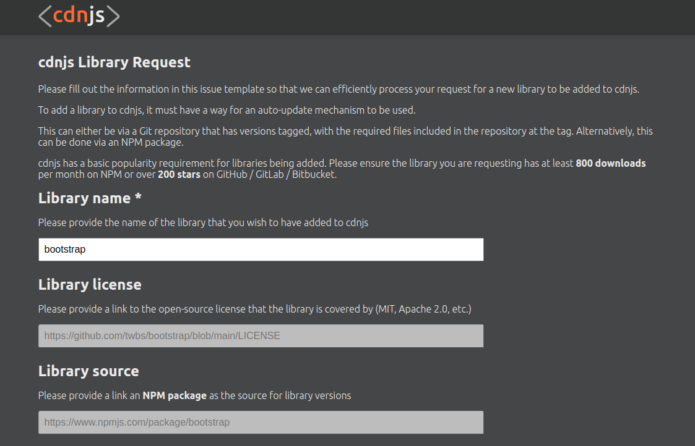

# cdnjs Library Request Form

A form to semi-automate the library adding process for cdnjs. In response to [this issue](https://github.com/cdnjs/packages/issues/1371)

[View Demo](https://tamalchowdhury.github.io/cdnjs-library-request-form/)

## Running the project locally

Run the project in an HTTP server. Try the [live server VS code extension](https://www.youtube.com/watch?v=i6EMMG6Hmjs) to run it on your computer.

Enter the library name, e.g: "bootstrap" and hit submit to get the repo data to see the package information formatted in json:

